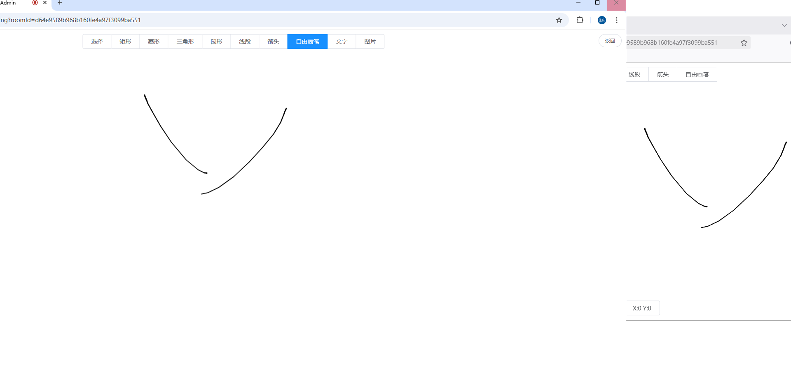

# 即迅在线会议系统

即迅在线会议系统是一套稳定的、适配全平台、基于浏览器的在线会议解决方案。

欢迎Star，您的Star是对我们最好的鼓励。

- Github地址：https://github.com/insmess/insmess-meeting</br>
- Gitee地址：https://gitee.com/insmess_enterprise/insmess-meeting.git

商务合作请加微信：insmess01

## 一、主要特点

- 适配国产化环境，可在国产化服务器、国产化客户端浏览器流畅运行；
- 支持私有化内网环境部署，不依靠外网环境；
- 提供二次开发SDK，可快速进行二次开发，并支持与第三方系统用户集成；

## 二、具备功能

- 及时消息服务，用户在会议中可发送文字、图片、文件等内容。
- 语音输入，通过语音发言，并将语音信息转写成文字。
- 音频交互，用户可通过麦克风进行音频交互。
- 视频交互，用户可通过摄像头进行视频交互。
- 会议成员管理，区分主持人与普通参会成员，主持人可对参会成员进行禁言，禁用摄像头等操作。
- 协同白板，多个用户可进行协同式白板操作。
- 屏幕共享，允许用户将屏幕内容实时分享给他人。
- 会议录制，可将会议过程中的用户音视频信息进行录制。
- 会议资料管理，对会议室资料进行上传、下载、删除等操作，并支持word的协同编辑功能。
- 会议加密，对会议设置密码，保证会议的安全性。

## 三、技术选型

- 前端：vue2
- 后端：Java8
- 中间件：mysql

## 四、快速开始

> 通过若依管理系统作为会议系统的管理端对及迅在线会议系统进行集成

1. 准备环境

   - 服务器：X86或ARM服务器
   - 内存：8G及以上
   - **预安装软件：docker**
   - 端口：8888、8380、8388、4443、5002、5003

2. 获取`insmess_meeting_x86.tar.gz`安装程序
- 百度网盘： https://pan.baidu.com/s/1zdn-UxOa2L78Qd005kIDAg?pwd=x1ft 提取码: x1ft
- 夸克网盘： https://pan.quark.cn/s/b35250dba400 提取码：KLx3

3. 执行以下命令进行快速安装

   ```shell
   # 解压安装包到当前目录
   tar -zxvf insmess_meeting_x86-20250327.tar.gz
   # 进入安装目录
   cd insmess_meeting_x86-20250327
   # 执行安装脚本（注意：在执行脚本前需要预安装docker）
   sh install.sh
   ```

   > 在脚本执行过程中需要根据提示输入IP地址

4. 访问http://ip:5003 进入登录页面，并输入用户名密码

   - 用户名：admin 密码：admin123

5. 登录成功后，点击会议管理-公共会议菜单，点击【新增】按钮创建会议

   

6. 点击【加入】按钮进入会议


> 浏览器默认不允许http使用摄像头和麦克风，可在浏览器中输入chrome://flags/#unsafely-treat-insecure-origin-as-secure进行配置


## 五、功能截图

### 5.1 语音视频交互


### 5.2 会议成员管理


### 5.3 屏幕共享


### 5.4 屏幕录制


### 5.5 协同白板



### 5.6 会议聊天


## 六、组件说明

### 6.1 insmess-media-server

负责媒体的传输、处理、加载和录制。它基于 GStreamer 多媒体工具包采用底层技术实现，并提供以下功能：

- 网络流媒体协议，包括 HTTP、RTP 和 WebRTC。
- 支持媒体混合和媒体路由/调度的群组通信（MCU 和 SFU 功能）。
- 对计算机视觉和增强现实过滤器（OpenCV）的通用支持。
- 媒体存储支持 WebM 和 MP4 的写入操作以及 GStreamer 支持的所有格式的播放。
- 在 GStreamer 支持的任何编解码器之间自动进行媒体转码，包括 VP8、H.264、H.263、AMR、OPUS、Speex、G.711 等。

### 6.2 insmess-server

用于对insmess-media-server进行管理，可通过session对会议进行管理。


### 6.3 insmess-meeting

即迅会议系统后端，负责会议系统的业务功能。

### 6.4 insmess-meeting-web

即迅会议系统前端页面。

### 6.5 insmess-meeting-manager-admin

会议管理系统的后端（若依框架）

### 6.6 insmess-meeting-manager-ui

会议管理系统前端（若依框架）

## 七、通信过程

通过insmess-meeting-manager会议管理系统（若依）对即迅会议系统进行集成。

1. 登录insmess-meeting-manager并生成token
2. 浏览器获取token并存储
3. 在insmess-meeting-manager-web中跳转即迅会议系统的页面（insmess--meeting-web），并携带会议id，会议密码以及token
4. insmess--meeting-web调用insmess-meeting-manager-admin的后台接口，校验token并根据token获取用户信息。
5. insmess-meeting-manager-admin将用户信息返回给insmess-meeting-web
6. 即迅会议使用该用户加入会议


## 六、集成说明

参考insmess-meeting-manager会议管理系统（若依）的交互代码

二次开发SDK代码地址：
https://gitee.com/insmess_enterprise/insmess-meeting-sdk.git